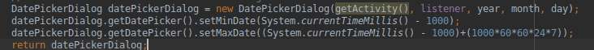

# Aplicación Android - Reservas Padel

### Explicación:

Esta aplicación se comunica con la API de nuestra aplicación de laravel. Básicamente es la misma aplicación que nuestro profesor paco de Acceso a Datos pero con unos ligeros cambios.

### Cambios:

1. Se ha cambiado todas las vistas para que hagan referencia a unas pista de padel y no a reservas de sitios.

2. Cambiado el logotipo de inicio sesión y registro.

3. Se ha añadido las clases DatePickerFragments y TimePickerFragments que consisten en unas pequeñas vistas para seleccionar fechas y horas de forma sencilla.

4. El DatePickerFragment tiene una restriccion de fechas y es que no puedes escoger fechas pasadas ni fechas superiores a 7 dias.

5. El TimePickerFragment no dispone de ninguna restricción porque no es posible.

### Mejoras:

1. Hacer una aplicación propia para que el diseño sea mas bonito.

2. Aplicar el patron MVP

3. Refactorizar código

